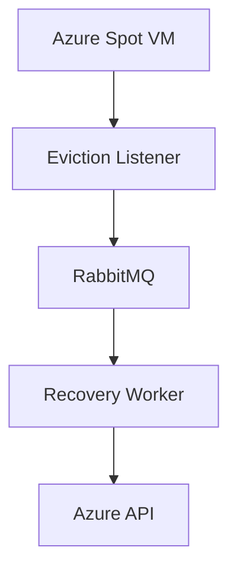
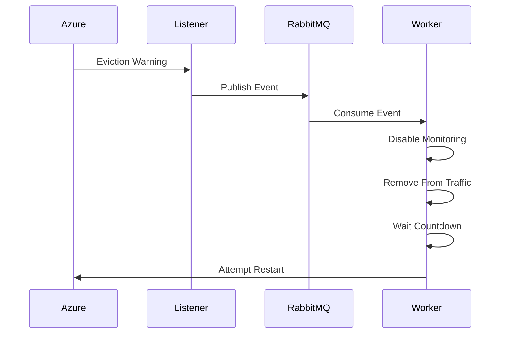
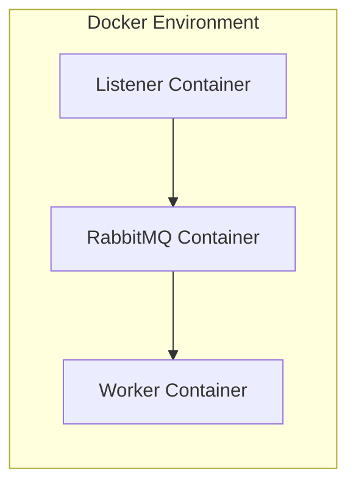

# Spot Phoenix

## Overview

Spot Phoenix is an event-driven system designed to handle
Azure Spot VM eviction events.

The system continuously monitors Azure Scheduled Events metadata endpoints
for eviction notifications. When an eviction event is detected, it is
published to a RabbitMQ queue.

A worker service consumes eviction events and performs contingency actions,
such as:
- removing the VM from traffic routing
- disabling monitoring
- waiting for a set delay and attempting VM restart or recovery

---

# Goals

- Detect Azure Spot VM eviction warnings
- Put eviction events into a message queue
- Execute automated contingency actions
- Attempt recovery after a set delay

---

# Architecture



---

# Components

## 1. Eviction Listener

- Listen to Azure Scheduled Events endpoint (json)
- Detect eviction notifications
- Publish events into RabbitMQ

Example eviction event:

```json
{
  "EventId":"258F9A75-A5C9-41BD-B952-3EF1E36C7467",
  "EventStatus":"Scheduled",
  "EventType":"Preempt",
  "ResourceType":"VirtualMachine",
  "Resources":["eviction-test"],
  "NotBefore":"Mon, 23 May 2026 01:18:39 GMT",
  "Description":"",
  "EventSource":"Platform",
  "DurationInSeconds":-1
}
```

## 2. Recovery Worker

- Consume eviction events
- Execute contingency logic
- Start restart countdown
- Attempt VM restart

Potential actions:
- Remove VM from Azure Traffic Manager
- Disable monitoring alerts
- Drain active traffic

---

# Event Flow



---

# Deployment Architecture



---

# Docker Deployment

The system is deployed using Docker Compose.

Services:
- rabbitmq
- listener
- worker

---

# Error Handling

## RabbitMQ Unavailable

The listener retries connection attempts periodically.

## Failed Recovery

Restart attempts may be retried with exponential backoff.

---

# Assumptions

- Spot VM eviction warnings arrive before termination.

---
