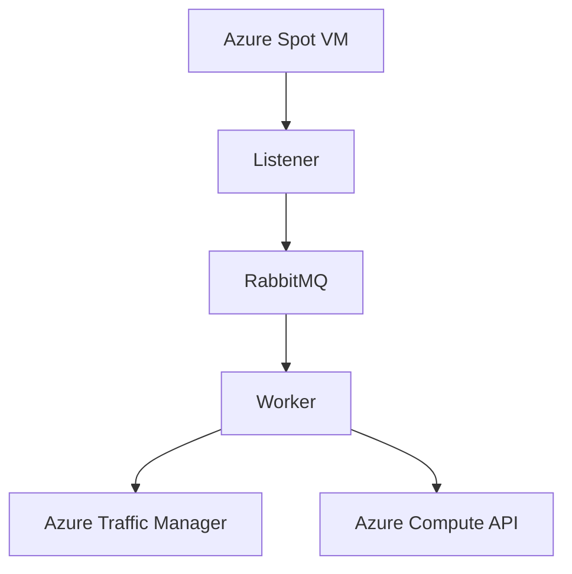
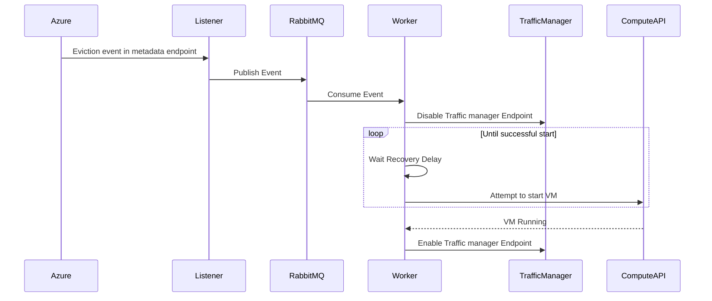
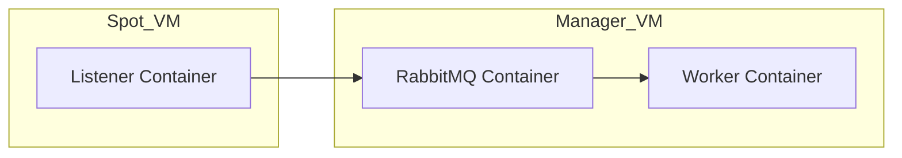

# Spot Phoenix

## Overview

Spot Phoenix is an event-driven system designed to automatically react to Azure Spot VM eviction events and perform recovery actions.

The system continuously monitors Azure Scheduled Events metadata endpoints for eviction notifications. When an eviction event is detected, it is published to a RabbitMQ queue.

A recovery worker consumes eviction events and performs actions:

* removing the VM from Azure Traffic Manager routing
* waiting for a configurable recovery delay
* attempting VM restart using Azure Compute API
* restoring traffic routing after successful recovery

---

# Architecture



---

# Components

## 1. Eviction Listener

The Listener service runs on the Spot VM and continuously monitors the Azure Scheduled Events metadata endpoint:

* Poll Azure Scheduled Events endpoint
```text
http://169.254.169.254/metadata/scheduledevents
```
* Detect eviction notifications (`Preempt`)
* Deduplicate events
* Publish eviction events to RabbitMQ

Example published event:

```json
{
  "event_id": "258F9A75-A5C9-41BD-B952-3EF1E36C7467",
  "event_type": "Preempt",
  "vm_name": "eviction-test",
  "resource_group": "eviction-test_group",
  "not_before": "2026-05-23T01:18:39Z",
  "detected_at": "2026-05-23T01:17:12Z"
}
```

---

## 2. RabbitMQ Message Broker

RabbitMQ acts as a message queue between the Listener and Recovery Worker.

---

## 3. Recovery Worker

The Recovery Worker runs on a separate management VM:

* Consume eviction events from RabbitMQ
* Disable Traffic Manager endpoint
* Wait for recovery countdown
* Start the evicted VM using Azure Compute API
* Verify VM power state
* Re-enable Traffic Manager endpoint after successful recovery

---

# Sequence of actions



---

# Deployment Architecture



The solution is deployed using Docker containers.

---

# Error Handling

## RabbitMQ Unavailable

The Listener continuously retries RabbitMQ connections until successful.

## Azure API Failure

Worker exceptions result in RabbitMQ message requeueing, allowing future recovery attempts.

## VM Recovery Failure

If the VM does not reach the `PowerState/running` state, the message remains available for retry processing.

---


# Technologies Used

* Python
* Azure Spot Virtual Machines
* Azure Scheduled Events
* Azure Managed Identity
* Azure Compute Management API
* Azure Traffic Manager
* RabbitMQ
* Docker
* Docker Compose

---
